Вшивцев Даниил Павлович 
1. Выбрал свой вариант под номером "3"
2. Создал сущности: Passenger для хранения информации из csv файла, Female для 2ого задания и Ticket к 3ему заданию.
репозиторий PassengersRepo. Также я добавил: ко всем сущностям их репозитории: PassengersRepo, MaleRepo и TicketRepo; 
сервис PassengerService, в котором есть все основные методы для работы с репозиториями.
3. Распарсил CSV фаил и сохранил все данные:
   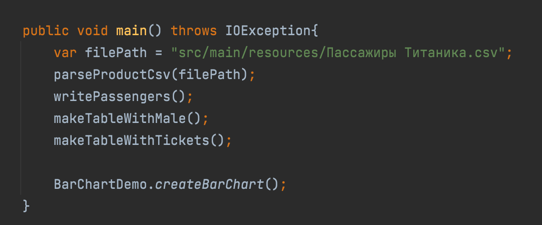
   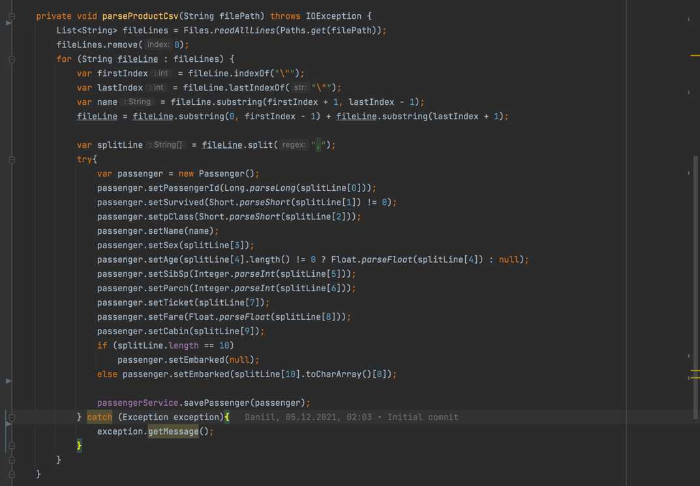
4. Создал файл БД SQL Lite и подключить ее к проекту:
   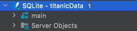
   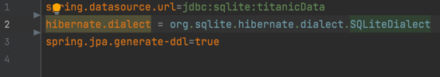
5. В БД создать набор таблиц согласно набору объектов.
   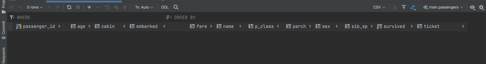
   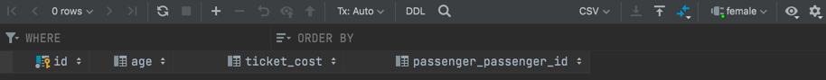
   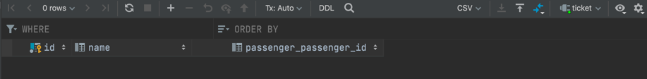
6. Все данные из набора объектов сохранил в БД.
7. Сделал набор SQL-запросов к БД согласно своему варианту задания: решение в файле PassengerService. 
8. Полученные данные вывел в текстовом виде в консоль:
   **1ое задание:**
   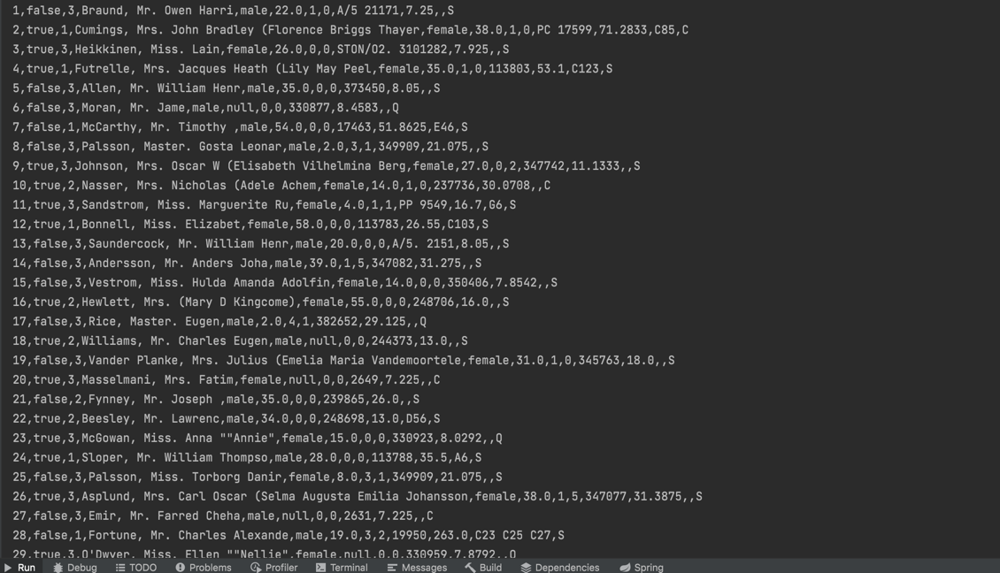
   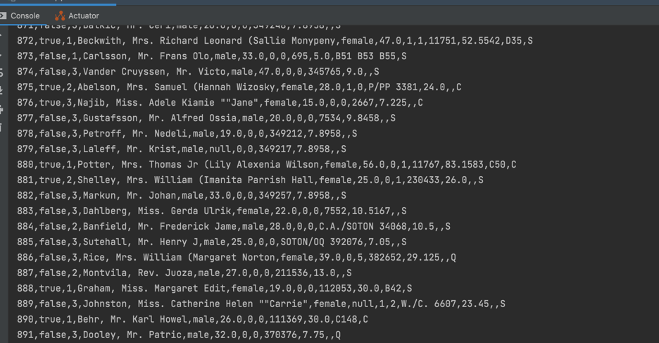

   **2ое задание:**
   

   **3ье задание:**
   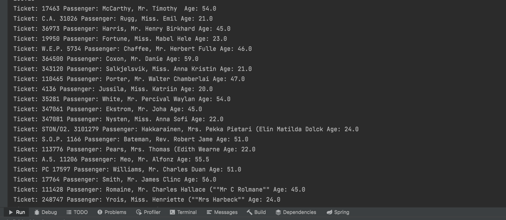
   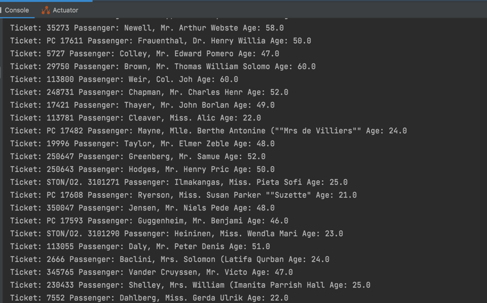

9. Числовые данные по заданию визуализировал в виде диаграммы:
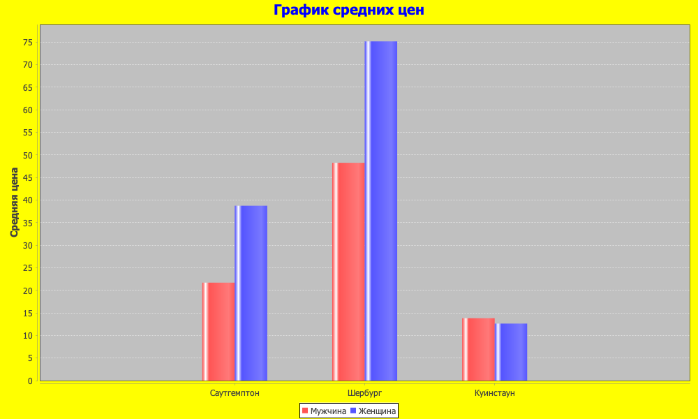
10. Для проекта создать открытый репозиторий на github и закоммитил туда всю работу по проекту. 
11. В файле README описал последовательность работы по своему проекту, а также прикрепил все скриншоты.

